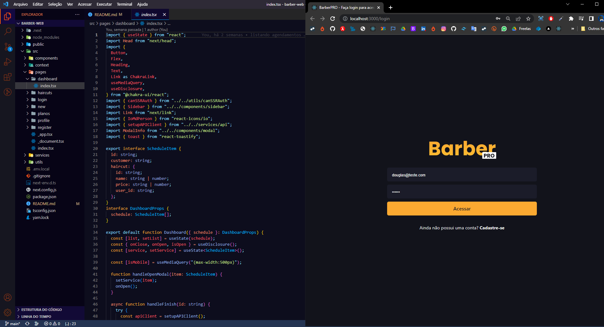

# BARBER PRO WEB

  

 

## Objetivo:

### Foi criar um sistema completo fullstack para barbearias do zero, com a possibilidade de assinatura mensal via pagamento recorrente com cartão de crédito, usando as tecnologias modernas presente no mercado.

## Descrição:

### Sobre as tecnologias utilizadas.

- `Foi criado com Next JS + Typescript.`
- `Utilizado chakra ui para estilização.`
- `E o Stripe como gateway de pagamentos.`

### <i> No modelo Free.</i>

- `O usuário vai precisar fazer seu cadastro para ter acesso.`
- `Com o login feito, o usuário poderá fazer o cadastro de até 3 cortes.`
- `Também não terá a opção de editar os cortes.`
- `Isso permitirá ele ter uma noção geral do sistema, se ele gostar tem a opção de virar premium.`

### <i> No modelo Premium.</i>

- `Para virar premium foi feita toda uma integração com um gateway de pagamento, isso possibilitará a cobrança recorrente por um cartão de crédito.`
- `O cliente poderá criar cortes ilimitados sem limitação.`
- `Editar modelos de cortes.`
- `Editar perfil.`

### Sobre o funcionamento do sistema.

- `Fazendo o seu cadastro e também criando os modelos de cortes, o usuário que controla terá acesso ao dashboard, onde possibilitará ele agendar ordens de serviços para os clientes de acordo com a chegada, e ir finalizando com o decorrer do funcionamento da barbearia.`

## <i>Douglas Monteiro</i> 😁🔥🚀
